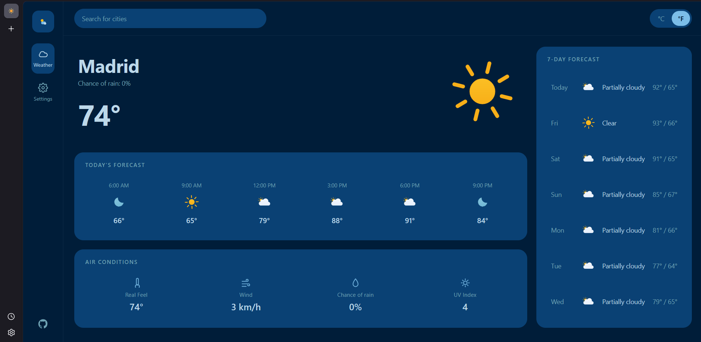

# Weather App

A weather app built for [The Odin Project](https://www.theodinproject.com/) curriculum.

**[Live Demo](https://w3nc.github.io/Project-Weather-App-The-Odin-Project/)**

## Features

- **Dynamic city search** with live suggestions
- **Current conditions** — temp, feels-like, wind, UV, precipitation chance
- **7-day forecast** and hour-by-hour today's forecast
- **°C / °F toggle** — converts instantly client-side
- **Animated weather icons** from [Meteocons](https://github.com/basmilius/weather-icons) (MIT)
- **Lazy-loaded icons** via Webpack's dynamic `import()`
- **Persistent settings** — default city + 12/24h time format saved to localStorage

## Tech Stack

- Vanilla JS
- Webpack 5

## Credits

- Weather icons: Meteocons by Bas Milius (MIT)
- Weather data: Visual Crossing
- Geocoding: Open-Meteo